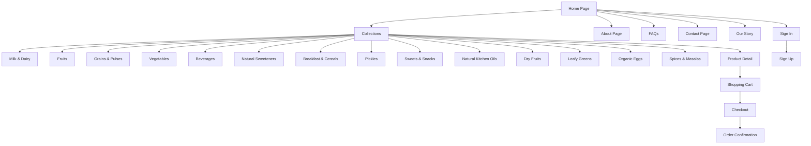
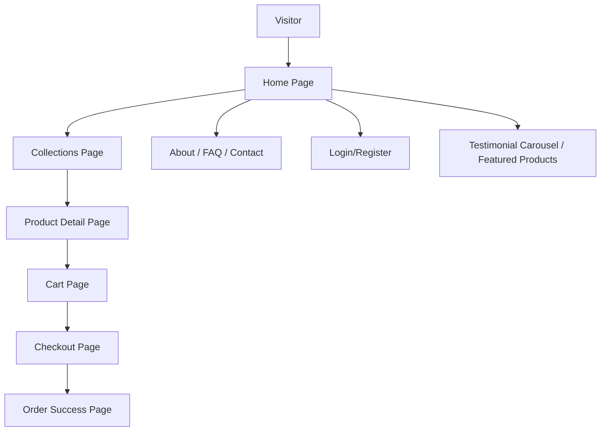
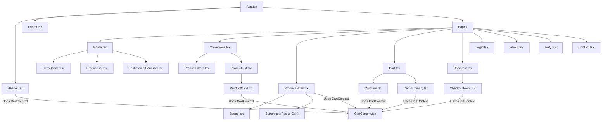
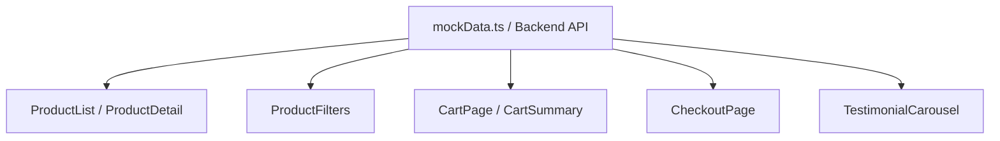
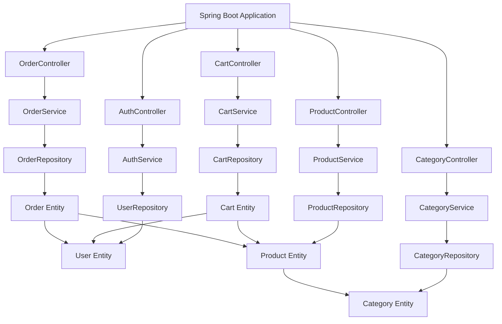

# GreenOrigin - Nourishing Lives, One Organic Choice 🍃🤝


GreenOrigin is **more than just an online store**-it’s a **community for mindful living and conscious choices**. Every product tells a story of **care, sustainability, and support for farmers** who dedicate their lives to growing food naturally.

Our mission is simple: to make **healthy living accessible and joyful**. From discovering carefully curated organic products to completing a purchase with ease, GreenOrigin ensures every step is **trustworthy, transparent, and uplifting**.

By choosing GreenOrigin, users aren’t just shopping-they are **joining a movement** that values **well-being, sustainability, and respect for our planet**. Every purchase nurtures both **personal health** and the **earth we all share**, creating a meaningful connection between people, nature, and the food they consume.

---


## 🔥 Key Features

### Frontend Features

* **Modern React Architecture:** React 18, TypeScript, Vite
* **Responsive Design:** Mobile-first approach with Tailwind CSS
* **Smooth Animations:** Framer Motion for interactive user experience
* **Shopping Cart:** Add, update, remove items; persistent state
* **User Authentication:** Login/Register integrated with backend
* **Product Management:** Browse, search, filter, and view products
* **Checkout Process:** Complete order placement workflow
* **Testimonials & Social Proof:** Carousel highlighting customer reviews
* **Informational Pages:** About, FAQ, Contact


---

## 🚀 Project Overview

GreenOrigin allows users to discover, browse, and purchase organic products with **high usability, secure checkout, and responsive design**. The platform emphasizes **trust, transparency, and convenience**, using organic badges, certifications, and user testimonials to guide decisions.

**Target Audience:** Health-conscious consumers, organic product enthusiasts, eco-friendly shoppers.

---


## 📸 Project Screenshots

### 🏠 Home Page

*Showcasing hero banner and featured products*

<p align="center">
  
</p>

### 🛒 Collections Pages

#### Milk & Dairy

*All milk & dairy products listed with filters*

<p align="center">
  
</p>

#### Fruits

*Fresh fruits collection*

<p align="center">
  
</p>

#### Grains & Pulses

*Grains and pulses with product details*

<p align="center">
  
</p>

#### Vegetables

*Organic vegetables collection*

<p align="center">
  
</p>

#### Beverages

*Juices, teas, and other organic beverages*

<p align="center">
  
</p>

#### Natural Sweeteners

*Honey, jaggery, and other natural sweeteners*

<p align="center">
  
</p>

#### Breakfast & Cereals

*Organic cereals and breakfast items*

<p align="center">
  
</p>

#### Pickles

*Homemade style pickles collection*

<p align="center">
  
</p>

#### Sweets & Snacks

*Organic sweets and healthy snacks*

<p align="center">
  
</p>

#### Natural Kitchen Oils

*Cooking oils made from natural sources*

<p align="center">
  
</p>

#### Dry Fruits

*Almonds, walnuts, cashews, and more*

<p align="center">
  
</p>

#### Leafy Greens

*Fresh leafy vegetables*

<p align="center">
  
</p>

#### Organic Eggs

*Organic eggs from free-range farms*

<p align="center">
  
</p>

#### Spices & Masalas

*Natural and organic spices*

<p align="center">
  
</p>

### 🛍️ Product Detail Page

*Detailed product information and add-to-cart option*

<p align="center">
  
</p>


### 📖 About Page

*Information about GreenOrigin and its mission*

<p align="center">
  
</p>

### ❓ FAQs Page

*Frequently asked questions*

<p align="center">
  
</p>

### 📞 Contact Page

*Contact form and customer support details*

<p align="center">
  
</p>

### 🌿 Our Story Page

*Story of the brand, sustainability, and community*

<p align="center">
  
</p>

### Join Our Organic Community

*Connect with us and be part of a sustainable, healthy lifestyle*

<p align="center">
  
</p>

### ✅ Success / Order Confirmation

*Form or order confirmation page showing success message*

<p align="center">
  
</p>

### 🛒 Shopping Cart

*Manage selected items before checkout*

<p align="center">
  
</p>

### 💳 Checkout Page

*Shipping and payment process*

<p align="center">
  
</p>

### ✅ Order Confirmation

*Order success page showing confirmation details*

<p align="center">
  
</p>

### 🔑 Sign In Page

*User login page*

<p align="center">
  
</p>

### 📝 Sign Up Page

*User registration page*

<p align="center">
  
</p>

### 🔒 Admin Login

*Admin login page for private access*

<p align="center">
  
</p>

### 🖥️ Admin Dashboard

*Admin can manage all platform data*

<p align="center">
  
</p>
---


## 🔗 Page Flow Diagram (GitHub Compatible)



---

✅ This way, your README will have:

1. **All screenshots with proper captions**.
2. **A professional page flow diagram** showing navigation clearly.

Do you want me to now **integrate this into your full README draft** (with intro, features, tech stack, diagrams, screenshots, etc.) so you can directly use it?


## 📦 Pages & Flow

### Primary Flow

```
Home → Collections → Product Detail → Cart → Checkout → Order Success
```

### Secondary/Informational Flow

```
Home → About / FAQ / Contact → Login/Register
```

### Page Breakdown

* **Home:** Hero banner, featured products, testimonials
* **Collections:** Search, filter, sort, and pagination
* **Product Detail:** Images, descriptions, specifications, certifications
* **Cart:** Add/remove/update items, view totals
* **Checkout:** Shipping info, payment selection, order confirmation
* **Login/Register:** Secure authentication, redirects
* **About/FAQ/Contact:** Brand story, FAQs, contact form

---

## 🎨 Design System

### Colors

* **Primary:** Purple (#6B46C1)
* **Secondary:** White & Black
* **Accent:** Green (organic badges)

### Typography

* **Font:** Inter
* **Weights:** 300, 400, 500, 600, 700

### Components

* **Buttons:** Primary, secondary, outline, ghost variants
* **Badges:** Status indicators (Organic, New, Discount)
* **Cards:** Product cards with hover effects
* **Forms:** Consistent validation and styling

---

## 🔧 Architecture & Project Structure

```
greenorigin/
├── public/
├── src/
│   ├── components/
│   │   ├── layout/        # Header, Footer
│   │   ├── hero/          # HeroBanner
│   │   ├── products/      # ProductCard, ProductList, ProductFilters
│   │   ├── testimonial/   # TestimonialCarousel
│   │   ├── cart/          # CartItem, CartSummary
│   │   ├── checkout/      # CheckoutForm
│   │   └── shared/        # Button, Badge
│   ├── pages/             # All page components
│   ├── context/           # AuthContext, CartContext
│   ├── data/              # Mock data fallback
│   ├── types/             # TypeScript definitions
│   ├── App.tsx
│   ├── main.tsx
│   └── index.css
├── package.json
├── tailwind.config.js
├── tsconfig.json
└── vite.config.ts
```

### Component Relationships

* **Header:** Cart count badge, navigation links (all pages)
* **Footer:** Contact info & page links
* **ProductCard:** Add to cart, navigate to Product Detail
* **CartItem/CartSummary:** Manage cart & proceed to checkout
* **CheckoutForm:** Collect shipping/payment info

---

## 🔄 State Management

* **CartContext:** Global state for cart operations

  * `addToCart()`, `removeFromCart()`, `updateQuantity()`, `clearCart()`
* **AuthContext:** Global state for user authentication
* **Local Storage:** Persist cart & user session

---

## 📈 Conversion Rate Optimization (CRO) Strategy

### Goals

* Increase add-to-cart & checkout conversions
* Reduce cart abandonment
* Boost repeat purchases

### Strategies

* Featured products & organic badges on homepage
* Persistent cart to retain user selections
* Clear CTA buttons and smooth checkout flow
* Testimonials & social proof for trust
* Mobile-first, responsive design for better engagement
* Optimized images & lazy loading for performance

---

## 🛠️ Local Development Setup

### Prerequisites

* Node.js v16+
* npm or yarn
* VS Code recommended

### Quick Start

```bash
# Clone the repo
git clone https://github.com/yourusername/greenorigin.git
cd greenorigin

# Install dependencies
npm install

# Start development server
npm run dev
```

**Development URL:** `http://localhost:5173`

### Build & Preview

```bash
# Build for production
npm run build

# Preview production build
npm run preview
```

---

## 📱 Responsive Breakpoints

```
Default: < 640px (Mobile)
sm: 640px+ (Large Mobile)
md: 768px+ (Tablet)
lg: 1024px+ (Desktop)
xl: 1280px+ (Large Desktop)
```

---

## 🗺️ User Journey Flow



---

## 🔗 Component Connection Diagram (GitHub Compatible)




---

## 📊 Data Flow Diagram



---

## 🔗 API Endpoints (Future Integration)

### Authentication

* `POST /api/auth/register`
* `POST /api/auth/login`

### Products

* `GET /api/products`
* `GET /api/products/:id`
* `POST /api/products` (admin)

### Categories

* `GET /api/categories`
* `POST /api/categories` (admin)

### Cart

* `POST /api/cart/add`
* `PUT /api/cart/update/:cartItemId`
* `DELETE /api/cart/remove/:cartItemId`

### Orders

* `POST /api/orders/place`
* `GET /api/orders/user/:userId`

---

## 🧪 Testing & Debugging

* React Developer Tools for props/state inspection
* Console logs for local debugging
* Mobile testing via browser dev tools and local network
* Lighthouse audit for performance optimization

---

## 🤝 Contribution Guidelines

1. Fork the repository
2. Create a feature branch: `git checkout -b feature/<feature-name>`
3. Implement changes & test thoroughly
4. Commit: `git commit -m "Add <feature-name>"`
5. Merge back to main branch & create a Pull Request

---

## 🔒 Security Considerations

* Input validation on all forms
* XSS & CSRF protection
* Secure API communication
* CORS handling

---

---

#  GreenOrigin Backend - Spring Boot API

A **robust, scalable, and secure backend** for the GreenOrigin organic products e-commerce platform. Built with **Spring Boot, Spring Data JPA, Spring Security, and MySQL/PostgreSQL**, this backend handles **user authentication, product management, cart operations, and order processing**.

It seamlessly integrates with the frontend, providing **RESTful APIs** for a high-performance e-commerce experience.

---

## 🔥 Key Features

### Backend Integration

* **Authentication APIs:** Register and login users securely
* **Product APIs:** CRUD operations for products
* **Category APIs:** Product categorization & filtering
* **Cart APIs:** Cart management for users
* **Order APIs:** Place orders and view order history
---

### Authentication

* **User Registration & Login** with JWT-based authentication
* **Secure password storage** with BCrypt
* **Role-based access control** (Admin/User)

### Product Management

* **CRUD operations** for products
* **Category-based product organization**
* **Search & filtering** support

### Cart & Order Management

* **Add, update, remove items in cart**
* **Checkout and place orders**
* **Order history and status tracking**

### Backend Infrastructure

* **Spring Boot 3.x** with **Spring Data JPA**
* **Database Integration**: MySQL/PostgreSQL
* **REST API Design**: Clean, versioned, and secure
* **Exception Handling**: Global error handling for consistent responses

---

## 🛠️ Architecture Overview



---

## 📦 Project Structure

```
greenorigin-backend/
├── src/
│   ├── main/
│   │   ├── java/com/greenorigin/
│   │   │   ├── config/           # Security, CORS, JWT
│   │   │   ├── controller/       # REST controllers
│   │   │   ├── entity/           # JPA entities
│   │   │   ├── repository/       # JPA repositories
│   │   │   ├── service/          # Business logic
│   │   │   └── dto/              # Data transfer objects
│   │   └── resources/
│   │       ├── application.properties  # DB & JWT configs
│   │       └── data.sql                  # Optional seed data
├── pom.xml                              # Maven dependencies
└── README.md
```

---

## 🔗 API Endpoints

### Authentication

| Method | Endpoint           | Description       | Access |
| ------ | ------------------ | ----------------- | ------ |
| POST   | /api/auth/register | Register new user | Public |
| POST   | /api/auth/login    | Login and get JWT | Public |

### Products

| Method | Endpoint           | Description             | Access |
| ------ | ------------------ | ----------------------- | ------ |
| GET    | /api/products      | Get all products        | Public |
| GET    | /api/products/{id} | Get product by ID       | Public |
| POST   | /api/products      | Create new product      | Admin  |
| PUT    | /api/products/{id} | Update existing product | Admin  |
| DELETE | /api/products/{id} | Delete product          | Admin  |

### Categories

| Method | Endpoint             | Description        | Access |
| ------ | -------------------- | ------------------ | ------ |
| GET    | /api/categories      | Get all categories | Public |
| GET    | /api/categories/{id} | Get category by ID | Public |
| POST   | /api/categories      | Create category    | Admin  |
| PUT    | /api/categories/{id} | Update category    | Admin  |
| DELETE | /api/categories/{id} | Delete category    | Admin  |

### Cart

| Method | Endpoint                      | Description               | Access |
| ------ | ----------------------------- | ------------------------- | ------ |
| POST   | /api/cart/add                 | Add item to cart          | User   |
| GET    | /api/cart/user/{userId}       | Get user's cart           | User   |
| PUT    | /api/cart/update/{cartItemId} | Update cart item quantity | User   |
| DELETE | /api/cart/remove/{cartItemId} | Remove item from cart     | User   |

### Orders

| Method | Endpoint                  | Description              | Access |
| ------ | ------------------------- | ------------------------ | ------ |
| POST   | /api/orders/place         | Place an order           | User   |
| GET    | /api/orders/user/{userId} | Get user’s order history | User   |

---

## 🗂️ Database Schema

### Users

| Column      | Type      | Notes                     |
| ----------- | --------- | ------------------------- |
| id          | BIGINT    | PK, auto-increment        |
| name        | VARCHAR   | Required                  |
| email       | VARCHAR   | Unique, required          |
| password    | VARCHAR   | Hashed                    |
| role        | ENUM      | USER / ADMIN              |
| created\_at | TIMESTAMP | Default current timestamp |

### Products

| Column       | Type    | Notes            |
| ------------ | ------- | ---------------- |
| id           | BIGINT  | PK               |
| name         | VARCHAR | Required         |
| price        | DECIMAL | Required         |
| description  | TEXT    |                  |
| image\_url   | VARCHAR | Optional         |
| category\_id | BIGINT  | FK to Categories |
| in\_stock    | BOOLEAN | Default true     |

### Categories

| Column | Type    | Notes    |
| ------ | ------- | -------- |
| id     | BIGINT  | PK       |
| name   | VARCHAR | Required |

### CartItems

| Column      | Type   | Notes          |
| ----------- | ------ | -------------- |
| id          | BIGINT | PK             |
| user\_id    | BIGINT | FK to Users    |
| product\_id | BIGINT | FK to Products |
| quantity    | INT    | Default 1      |

### Orders

| Column       | Type      | Notes                     |
| ------------ | --------- | ------------------------- |
| id           | BIGINT    | PK                        |
| user\_id     | BIGINT    | FK to Users               |
| total\_price | DECIMAL   | Required                  |
| status       | ENUM      | PENDING / COMPLETED       |
| created\_at  | TIMESTAMP | Default current timestamp |

---

## 🧪 Testing & Debugging

* **Unit Testing:** JUnit 5 + Mockito
* **Integration Testing:** Spring Boot Test
* **Postman / Insomnia:** Test API endpoints
* **H2 Database (dev):** Lightweight in-memory testing
* **Logging:** SLF4J + Logback

---

## 🔒 Security Considerations

* Password hashing with BCrypt
* Role-based access control (Admin/User)
* Input validation for all request payloads
* CORS configuration for frontend integration
* Exception handling for secure responses

---

## 🚀 Local Development Setup

### Prerequisites

* Java 17+
* Maven 3.8+
* MySQL/PostgreSQL
* IDE: IntelliJ / VS Code

### Quick Start

```bash
# Clone the repository
git clone https://github.com/yourusername/greenorigin-backend.git
cd greenorigin-backend

# Build and run
mvn clean install
mvn spring-boot:run
```

**API Base URL:** `http://localhost:8080/api`

---

## 🤝 Contribution Guidelines

1. Fork the repository
2. Create a branch: `git checkout -b feature/<feature-name>`
3. Implement changes & test thoroughly
4. Commit: `git commit -m "Add <feature-name>"`
5. Push & create Pull Request

---


<p align="center">
  <b>🌱 GreenOrigin - Nourishing Lives, One Organic Choice at a Time 🍃🤝</b>
</p>

<div align="center" style="background: linear-gradient(135deg, #a8e6cf, #dcedc1); padding:20px; border-radius:15px; box-shadow:0 4px 15px rgba(0,0,0,0.2);">

  <a href="https://github.com/your-username" target="_blank">
    
  </a>
  
  
  

  <p style="margin-top:10px; font-size:14px; color:#333;">
    Built with ❤️ to promote <b>healthy living</b> and support <b>organic farming</b>.  
    Connect, explore, and shop consciously 🌏
  </p>
</div>

---


